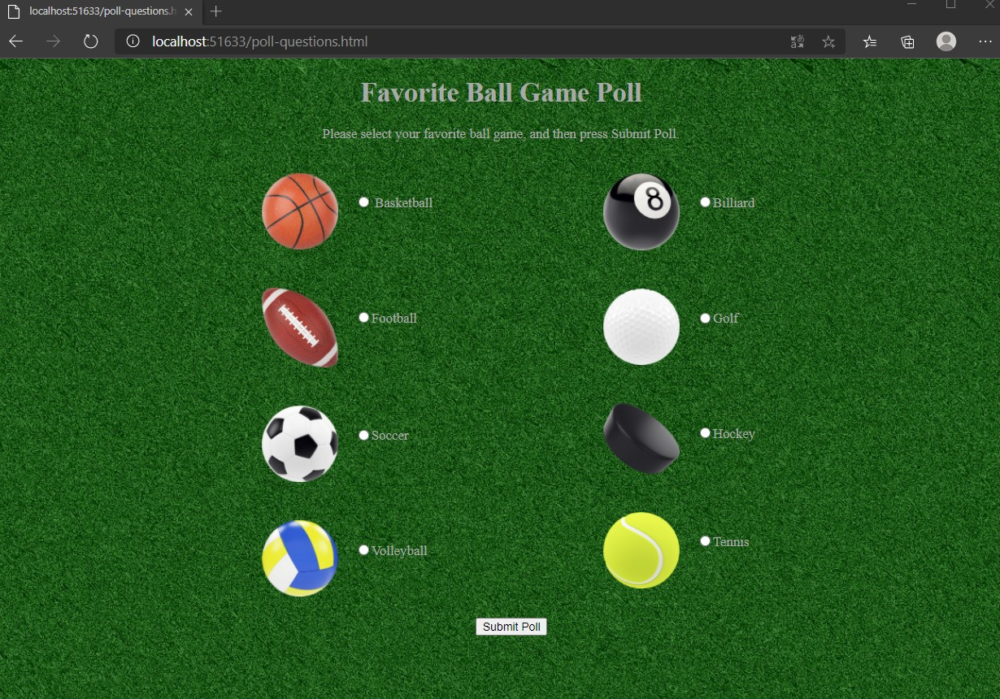

# Module 3: Configuring Middleware and Services in ASP.NET Core

## Lab: Configuring Middleware and Services in ASP.NET Core 

1. **Nombres y apellidos:** Francisco Javier Moreno Quevedo
2. **Fecha:** 06/12/2020
3. **Resumen del Ejercicio:**  Añadir los componentes necesarios para hacer funcional la aplicacion 2/4
4. **Dificultad o problemas presentados y como se resolvieron:** Ninguna


- Ejercicio 4: Injecting a Service to a Controller

  - En el middleware añadimos 

  ```
      app.UseMvcWithDefaultRoute();
  ```

  - Creamos la carpeta controllers
  - Añadimos el **HomeController**
  - En la accion index sustituimos 

  ```cs
      return View();
  ```

  - por

  ```cs
      return Content("Hello from controller.");
  ```

  Ejecutamos 

  


- Movemos

```cs
    app.Run(async (context) =>
    {
        await context.Response.WriteAsync("This text was generated by the app.Run middleware. wwwroot folder path: " + env.WebRootPath);
    });
```


- al inicio y ejecutamos


- Seleccionamos el codigo

```cs
    SortedDictionary<SelectedGame, int> gameVotes = pollResults.GetVoteResult();

    foreach (KeyValuePair<SelectedGame, int> currentVote in gameVotes)
    {
        await context.Response.WriteAsync($"<div> Game name: {currentVote.Key}. Votes: {currentVote.Value} </div>");
    }
```

- lo reemplazamos por

```cs
	context.Response.Headers.Add("content-type", "text/html");
    await context.Response.WriteAsync("Thank you for submitting the poll. You may look at the poll results <a href='/?submitted=true'>Here</a>.");
```

- El **HomeController** lo dejamos de la siguiente manera:

   

                public class HomeController : Controller
        {
            private IPollResultsService _pollResults;
            public HomeController(IPollResultsService pollResults)
            {
                _pollResults = pollResults;
            }
            public IActionResult Index()
            {
                if (Request.Query.ContainsKey("submitted"))
                {
                    StringBuilder results = new StringBuilder();
                    SortedDictionary<SelectedGame, int> voteList = _pollResults.GetVoteResult();
        
                    foreach (var gameVotes in voteList)
                    {
                        results.Append($"Game name: {gameVotes.Key}. Votes: {gameVotes.Value}{Environment.NewLine}");
                    }
            
                    return Content(results.ToString());
                }
                else
                {
                    return Redirect("poll-questions.html");
                }
                //return Content("Hello from controller.");
            }
        }

Ejecutamos




